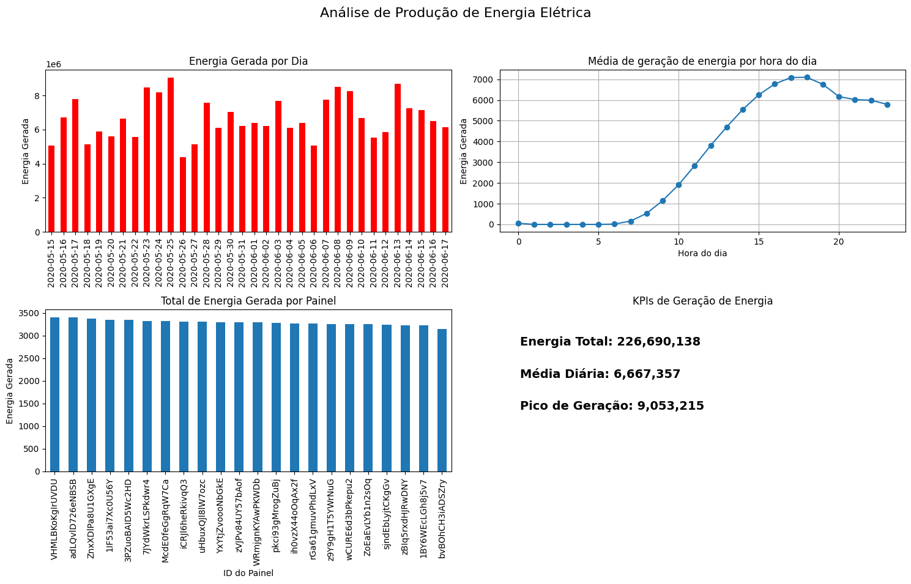
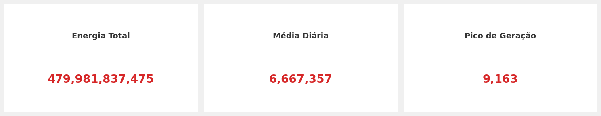

# 📊 Análise de Geração de Energia Solar

---

## 🧾 Sobre o projeto

Este projeto tem como objetivo analisar dados de geração de energia solar fotovoltaica, explorando padrões de produção, comportamento temporal e desempenho dos sistemas ao longo do tempo.

A proposta é transformar dados brutos em informações úteis para análise e tomada de decisão, utilizando Python como principal ferramenta.

---

## 🎯 Objetivos da análise

- Compreender o comportamento da geração de energia ao longo do tempo
- Identificar padrões diários e horários de produção
- Avaliar o desempenho dos painéis/sistemas
- Criar KPIs para monitoramento da geração de energia
- Gerar insights a partir da análise exploratória dos dados

---

## 🛠️ Tecnologias utilizadas

- Python 🐍
- Pandas
- Matplotlib

---

## 🧱 Etapas do projeto

### 1. 📥 Importação dos dados
- Leitura de arquivo `.csv` utilizando Pandas

### 2. 🧹 Limpeza de dados
- Remoção de valores nulos (quando aplicável)
- Ajuste de tipos de dados
- Verificação de inconsistências

### 3. ⏱️ Conversão de datas e horas
- Conversão da coluna de data/hora para formato datetime
- Extração de variáveis como:
  - Dia
  - Hora
  - Data

### 4. 📊 Análise exploratória dos dados
- Exploração do comportamento da geração de energia
- Identificação de padrões temporais
- Comparação entre sistemas/painéis

### 5. 📈 Criação de gráficos
- Geração de energia ao longo do tempo
- Média de geração por hora do dia
- Comparação de desempenho entre painéis

### 6. 📊 Criação de KPIs
- Energia total gerada
- Média diária de geração
- Pico de geração de energia

---

## 📷 Visualizações
### 📈 Grafico de Energia Gerada por Dia / ⌚ Media de Geração de Energia por Hora / ☀️ Total de Energia Gerada por Cada Painel

### 🧾 KPIs Criadas

---

## 🔍 Principais insights

- A geração de energia segue um padrão diário bem definido, com picos de produção em horários específicos do dia.
- O comportamento da geração está diretamente relacionado à disponibilidade de irradiação solar.
- Os sistemas/painéis analisados apresentam desempenho relativamente equilibrado ao longo do período estudado.
- A variação diária indica influência de fatores externos como clima e intensidade solar.

---

## 🚀 Possíveis melhorias

- Aplicação de modelos preditivos para estimar geração futura de energia
- Inclusão de variáveis climáticas (temperatura, irradiação, clima)
- Criação de dashboard interativo (Power BI ou Plotly Dash)
- Automatização do pipeline de análise de dados
- Análise de eficiência energética por região ou tipo de painel

---

## 👨‍💻 Autor

Projeto desenvolvido por **Daniel Brum** como parte do portfólio de análise de dados com Python.
